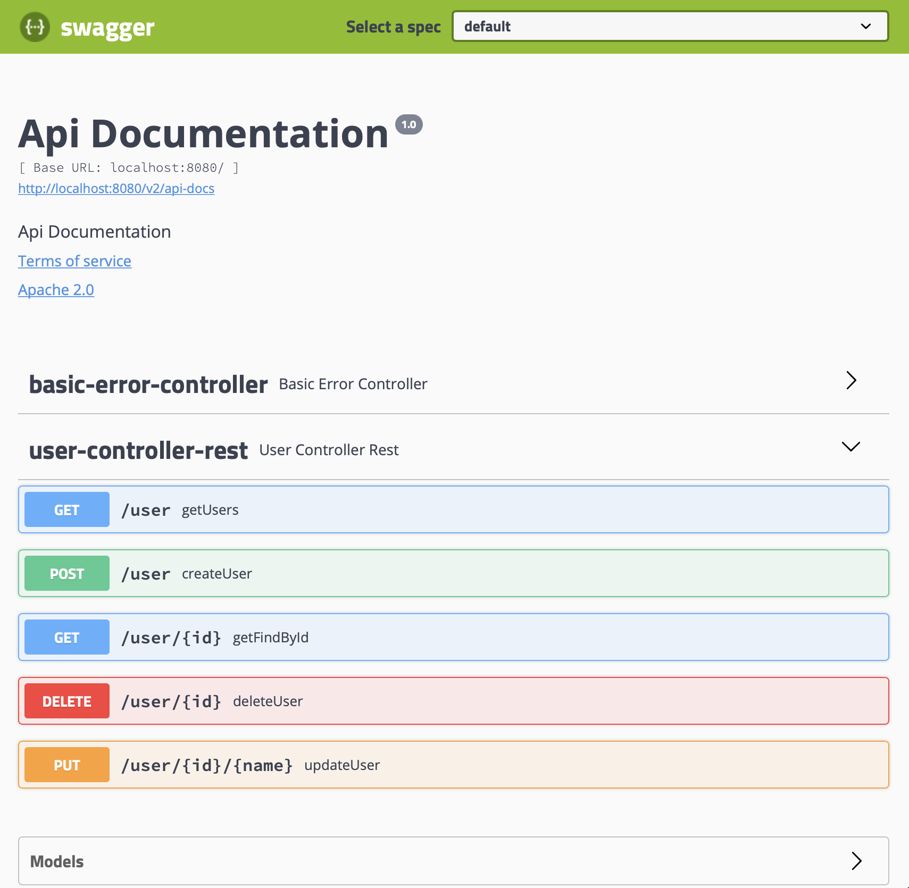
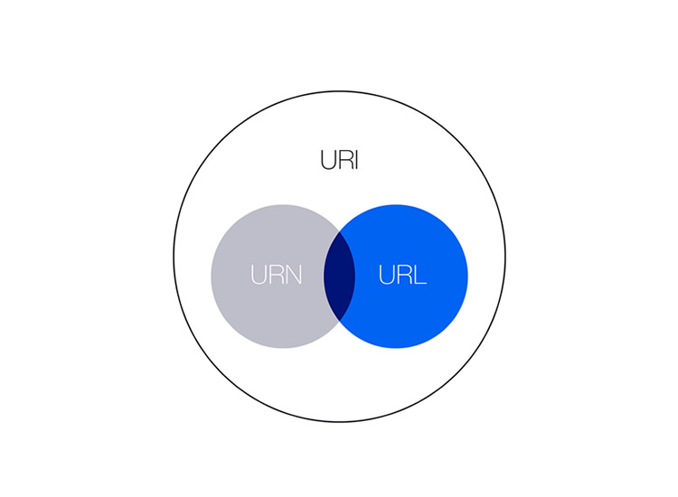

# Spring dışında dependency injection için kullanabileceğimiz framework’ler / kütüphaneler nelerdir ? (Herhangi bir programlama dili için olabilir.)

> ## .Net
>
> - Ninject
> - Autofac
> - Castle Windsor
> - Spring.NET.
> - DevArchitecture

> ## Javascript
>
> - Angular
> - inversify
> - typedi
> - tsyringe
> - aurelia-dependency-injection

> ## PHP
>
> - Laravel
> - Codeigniter
> - Symfony
> - Nette DI
> - Phalcon

<br/><br/>

# @SpringBootApplication anotasyonu hangi anotasyonları kapsamaktadır ? Görevlerini kısaca açıklayınız.

SpringBootApplication anotasyonu, @EnableAutoConfiguration,@ComponentScan ve @Configuration anotasyonlarına eşdeğerdir, yani üçünün yaptığı toplam işi SpringBootApplication yapabilir.

> ### @EnableAutoConfiguration
>
> - Eklediğiniz jar bağımlılıklarına göre Spring uygulamanızı otomatik olarak yapılandırmaya çalışır
>
> ### @ComponentScan
>
> - Uygulamanın @Component anotasyonu bulunan paketlerinde taramayı etkinleştirir
>
> ### @Configuration
>
> - Bağlamda ekstra bean kaydetmeye veya ek configuration sınıflarını kullanmaya izin verir

<br/><br/>

# @Primary, @Qualifier anotasyonlarının kullanım amaçlarını açıklayınız.

**@Bean** anotasyonuna parametre olarak string verebiliriz veya **@Qualifier** anotasyonuna parametre olarak string verebiliriz ikiside **aynı** işlevi görür bean'i **niteler** bu sayede context içinden ararken yani bean'i çağırırken bean'e verdiğimiz string parametre üzerinden çağırabiliriz, ancak bean'i çağırırken parametre vermezsek eğer default bir bean tanımlamamız gerekir bunu da **@Primary** anotasyonu yardımıyla yaparız, default olmasını istediğimiz func için **@Primary** anotasyonunu kullanabiliriz.

> ### @Qualifier

```java
                                                                                                            @Bean
@Bean("tennisSport")                                                                                        @Qualifier("tennisSport")
public Sport football(){                                       Eşittir                                      public Sport football(){
    Sport sport = new Sport();                                   ==                                         Sport sport = new Sport();
    sport.sportName= "name is football";                                                                    sport.sportName= "name is football";
    return sport;                                                                                           return sport;
}                                                                                                           }
```

<br/><br/>

# CoC(Convention over configuration) kavramını seçtiğiniz bir örnek üzerinden açıklayınız

> Esnekliği ve kendini tekrar etme(DRY) ilkelerini kaybetmeden vermesi gereken kararların sayısını azaltmaya çalışan bir yazılım tasarım paradigmasıdır. Örnek olarak mesela Türkiye'de insanlar bir defa tokalaşır, Ukrayna'da iki defa, Erzurumlular ise üç defa tokalaşır ve bir Erzurumlu Ukraynaya gittiğinde ortak bilinç olmadığı için sorun yaşanır ve Devuşka vs Dadaş yaşanır :) yani her comunity'nin kendi ortak convention'ları vardır, bu sayede işlerini daha ezbere ve hızlı gerçekleştirebilirler, aynı metodoloji yazılım geliştirirkende uygulanır ve bu sayede proje üzerinde sürekli farklı durumlar için farklı kodlar yazmak zorunda kalmaz ekip, standarta oturur işler ve stabilizasyon sağlanır, mesela .Net developerlar interface isimlendirmelerinde başına I harfi koyarken Java developerlar sonuna interface yazmayı tercih eder, bunun gibi proje ve takım içinde kendi Convention'larımızı belirleyip CoC ilkesini sağlayabiliriz

<br/><br/>

# Aspect Oriented Programlama nedir ? Avantajları ve dezavantajları nelerdir ?

> Kod yazarken bazı temel kriterlere dikkat etmekteyiz bunlar; okunabilirliği, bakımı(maintability), modülaritesi ve tekrar kullanılabilirliği (reusability) gibi şeyler, proje ne kadar büyürse büyüsün bunu sağlamanın yolu AOP'den geçmekte, Cross Cutting Concerns dediğimiz yapılar vardır bunlar; security, caching, exception handling ve logging, bunları uygulamanın her yerinden kullanmak gerekebilir, işte bunları AOP metodolojisiyle ele aldığımızda hem projenin her yerinden kullanılabilir hemde soyutlanmış bir şekilde kullanılır, en güzel yanıda odu abstraction'ın sağlanabilmesi

<br/><br/>

# SOLID prensiplerini kısaca açıklayınız. Sizce her koşulda bu prensipler çerçevesinde mi kod yazılmalıdır ? Neden ?

SOLID, Robert C. Martin'in beş yazılım tasarım ilkesinin kısaltmasıdır.

> - **S**ingle Responsibility: Bir nesnenin sadece bir sorumluluğu olmalıdır
> - **O**pen Closed: Nesne genişlemeye açık, değişikliğe kapalı olmalıdır
> - **L**iskov's Substitution: Nesneler, programın çalışmasında sorun yaratmadan kendi alt örnekleriyle değiştirilebilmelidir
> - **I**nterface Segregation: Nesneler ihtiyaç duymadıkları metotların Interface'lerinden ayrıştırılmalıdır
> - **D**ependency Inversion: Yüksek seviyeli sınıflar, düşük seviyeli sınıflara bağlı olmamalı, her ikisi de soyut kavramlara bağlı olmalıdır

SOLID hakkında farklı eleştiriler vardır bunlara okuduklarım kadarıyla kendi fikirlerimi belirtmek istiyorum;

> - SOLID kurallarının belirsiz olması, gri alanda kalması
>   - Aslında bu durum SOLID ilkelerini tam olarak anlayamamış olanların argümanıdır
> - SOLID karmaşık kodlara yol açıyor
>   - Loosely Coupled ilkesi kodların birbiri ile bağlantısını anlayamama, tüm kod hikayesini kavrayamama sorununa yol açıyor diyor ama buda yanlış kullanımlardan ortaya çıkan bir sorun beence
> - SOLID fazla idealisttir
>   - SOLID gerçek dünyada uygulanamayacak kadar mükemmeliyetçi diyor ama bence solid kurallarının ucunu açık bırakması bu sorunu engelliyor, yani kodunu istediğin miktarda SOLID yapabilirsin, az çok sana kalmış
> - Liskov ikame ilkesinin tamamen yararsız olduğunu ve Martin'in "SOLID" kısaltmasının tamamlanması için eklediği fikri
>   - Elbette bu hiçbir anlam ifade etmiyor, çünkü kısaltmanın kendisi Martin ilkeleri öğretmeye başladıktan sonra geldi ve bu Michael Feathers'ın bir fikriydi.

Özetle benim fikrim SOLID ilkeleri her zaman her yerde kullanılmaz, bazen bazı durumları SOLID ile ifade edemeyebiliriz ancak bu durumlar nadirdir, bu durumu fark ettiğimizde SOLID dışına çıkabiliriz ama bu son çare olmalıdır ve SOLID'e katı kurallar çerçevesi değilde bir yaklaşım, bir bakış açısı olarak bakmalı ve fikirlerimizi birkez de SOLID perspektifiyle değerlendirirsek doğruyu bulma yolunda bize fayda sağlayacaktır.

<br/><br/>

# Swagger nedir, ne amaçla kullanılmaktadır ?

<table>
  <tr>
    <td valign="top"></td>
    <td valign="top" width="500">Swagger, JSON kullanılarak ifade edilen RESTful API'leri dökümante etmek için bir araçtır. Swagger, RESTful web hizmetlerini belgelemek ve kullanmak için bir dizi açık kaynaklı yazılım aracıyla birlikte kullanılır.</td>
    <td></td>
  </tr>
</table>

<br/><br/>

# Richardson Maturity Model’i seviyeleriyle birlikte açıklayınız

Richardson Maturity Model Rest API’lerimizin hangi seviyede olgun olduğunu gösteren bir olgunluk seviyesidir. RMM 4 seviyeden oluşmaktadır ve 0’dan 3’e başlayan seviyeler, yukarı doğru çıktıkca daha etkin kullanıldığını ifade etmektedir.

> ### Level 0: Swamp of POX
>
> - Servisimizdeki sadece tek metod üzerinden POST olarak erişebildiğimiz seviyedir. Bu seviye transfer protokolü olarak da adlandırılmaktadır
>
> ### Level 1: Resources
>
> - Servimizdeki URI üzerinden, bir metot üzerinden erişilebildiğimiz seviyedir. Örnek URI http://localhost/students/1
>
> ### Level 2: HTTP verbs
>
> - POST, PUT, GET ve DELETE metotları çağırdığımız seviyedir.
>
> ### Level 3: Hypermedia controls
>
> - Servislerimizde URI’nin istek gönderip cevaba göre tekrar URI’ye istek yapabildiğimiz bir seviyedir. Servis üzerinden gelen cevaba göre akıştaki davranışı görebiliriz. HATEOAS kullandığımız seviyedir.

<br/><br/>

# URL, URI, URN kavramlarını bir örnek üzerinden açıklayınız

<table>
  <tr>
    <td valign="top"></td>
    <td valign="top">

> - **URI(Uniform Resource Identifier)**
>   - URI, bir adı veya kaynağı tanımlamak için kullanılan bir karakter dizisidir. Bir kaynağı konuma, ada veya her ikisine göre tanımlar. Eğer bir URI bir kaynağı konuma göre tanımlarsa aynı zamanda bir URL, ada göre tanımlarsa aynı zamanda bir URN’dır. Kısacası URN ve URL, URI’ ın alt kümeleridir.
> - **URL(Uniform Resource Locator)**
>   - Bir kaynağı tanımlayan ve aynı zamanda bu kaynağa ulaşmamız için gereken bilgiyi içeren bir URI’dır. Örnek olarak, adınız bir URI olabilir, ancak adınız konumunuzu bulmaya yaramadığı için bir URL olamaz.
>       - https://semihshn.com/blog.html **=>** semihshn.com’a ulaşmak için gereken bilgiyi içerir.
> - **URN(Uniform Resource Name)**
>   - URN, bir kaynağı benzersiz bir adla tanımlar, ancak bunun nerde bulunduğunu belirtmez. URL’lerden farklı olarak, URN’ler kaynağın konumunu belirtmez.
>       - semihshn.com/blog/deneme.html **=>** bir web sayfasını benzersiz bir şekilde tanımlamasına rağmen konum bilgisi(protokol) içermediği için URL değilir

   </td>
  </tr>
</table>

<br/><br/>

#  Idempotency nedir ? Hangi HTTP metotları idempotent’ tir ?

> Bir metodun bir defa çağrıldığında alınan sonuç ile birden fazla kez çağrıldığında alınan sonuç aynı ise bu bir idempotent metottur.
> - **GET**
>   - Sunucuya /products/1 şeklinde bir istek gönderdiğimizde, id si 1 olan kayıt dönecektir. Bu isteği birden fazla kez tekrarlamamız sonucu değiştirmeyecektir. Bundan dolayı GET **idempotenent** bir metottur.

> - **PUT**
>   - /products/1
<br/>body: {‘name’:’Karpuz’, ‘quantity’:5} <br/>
Sunucuya yukarıdaki gibi bir istek gönderdiğimizde id si 1 olan değer Karpuz olarak güncellenecektir. İsteği bir kez daha gönderdiğimizde veritabanındaki değer Karpuz olduğundan bir değişiklik olmayacaktır. Bu da **idempotenent** bir metottur.

> - **DELETE**
>   - /products/1<br/>
Sunucuya yukarıdaki gibi bir istek gönderdiğimizde id si 1 olan kayıt silinecektir. İlgili isteği tekrar çağırdığımızda id si 1 olan bir kayıt olmadığından herhangi bir işlem gerçekleşmeyecektir. Bu da **idempotenent** bir metottur.

> - **POST**
>   - /products<br/>
body: {‘name’:’Karpuz’, ‘quantity’:10}<br/>
Sunucuya yukarıdaki gibi bir istek gönderdiğimizde, {‘id’:’4’, ‘name’:’Karpuz’, ‘quantity’:10} şeklinde bir kayıt oluşacaktır. İlgili isteği bir kez daha çağırırsak {‘id’:’5’, ‘name’:’Karpuz’, ‘quantity’:10} şeklinde bir kayıt daha oluşacaktır. Yani kaç defa çağırırsak o kadar yeni kayıt oluşacaktır. Bundan dolayı POST **non-idempotenent** bir metottur.

<br/><br/>

# RFC (Request For Comment) neyi ifade etmektedir ? HTTP hangi RFC dokümanında açıklanmıştır ? Bu dokümanda HTTP hakkında ne tür bilgiler yer almaktadır ?
> - RFC dediğimizde aklımıza gelen aslında internetin standartlarıdır. Internet protokolü, mekanizması için bu protokolleri ve mekanizmasını tanımlayan bir RFC vardır.
> - HTTP/1.0 RFC 1945, HTTP/1.1 RFC 2068
> - Bu dökümanlarda Http metodlarından,Http durum kodlarından,URI,URL,Tarih formatlarından, Mesaj bölümlerinden(Header,Body vs.), cache kontrol mekanizmasından, güvenli ve idempotent methodlar gibi konulardan bahsedilmektedir. 
